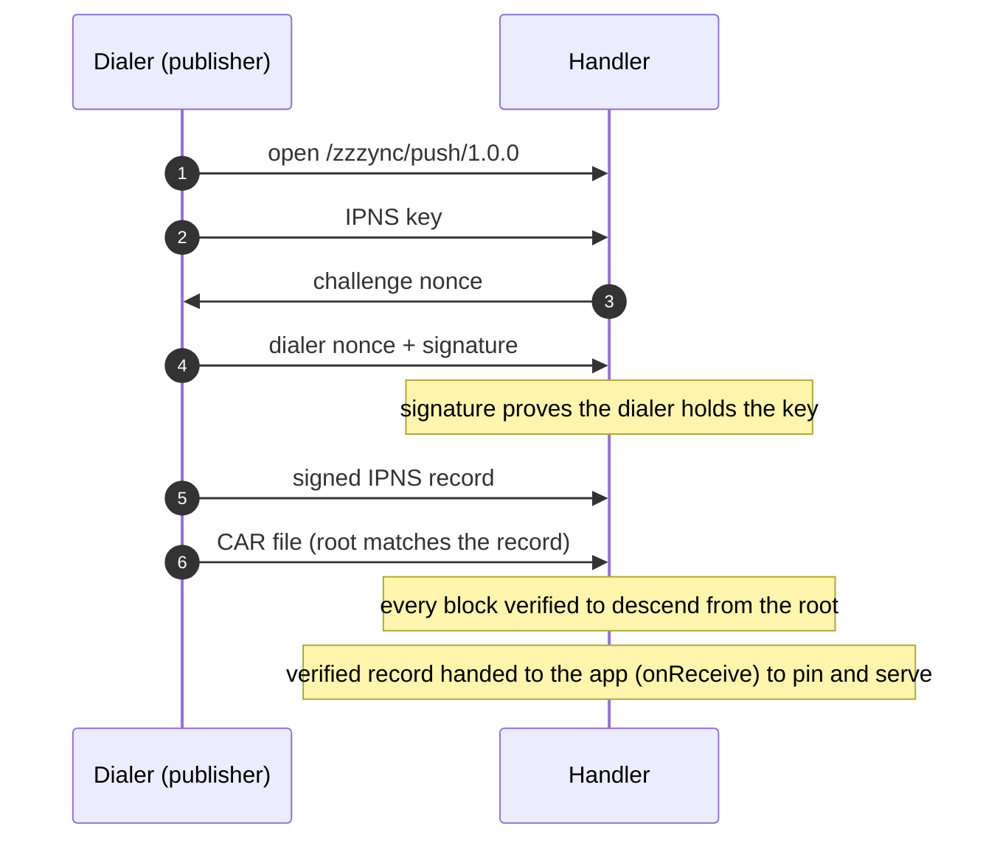

# 💤<sub><sup>ync</sup></sub>

> A libp2p protocol for handing a signed dataset to another peer that can serve it as a verifiable replica of the original publisher.

## Push protocol

Protocol id `/zzzync/push/1.0.0`.



A publisher proves it holds an IPNS key, then streams a signed IPNS record and a CAR of its content to a handler. The handler verifies the signature and the content, then hands the record to your application to pin and serve.

After the IPNS key and before the challenge nonce, the dialer sends an optional auth frame: a varint-prefixed byte payload (a delegation-chain CAR, for example). A varint of `0` means no frame. The handler passes the frame bytes (or `undefined` if absent) to `allow.multihash` via `options.auth` so the application can validate the delegation. On the dialer side, pass `auth?: () => Uint8Array | Promise<Uint8Array>` to `dialZzzync`. On the handler side, the frame is byte-capped (default `DEFAULT_MAX_AUTH_FRAME_BYTES`); override via `CreateHandlerOptions.maxAuthFrameBytes`.

The result is a durable, verifiable copy that stays available even while the publisher is offline.

## Install

```sh
npm install @tabcat/zzzync
```

## Docs and Usage

API reference and examples: https://tabcat.github.io/zzzync

## Credits

Won a [gold medal at HACKFS 2022](https://ethglobal.com/showcase/zzzync-xk96u). Additional work was funded by a [Protocol Labs grant](https://github.com/tabcat/rough-opal). Current work is independent.
