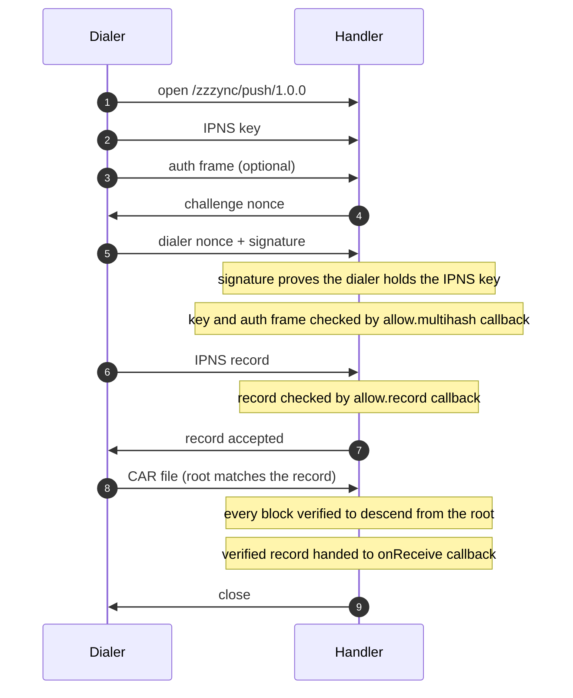

# 💤<sub><sup>ync</sup></sub>

> A libp2p protocol for handing a signed dataset to another peer that can serve it as a verifiable replica of the original publisher.

## Push protocol

Protocol id `/zzzync/push/1.0.0`.



A publisher proves it holds an IPNS key, sends a signed IPNS record, and waits for the handler to accept it before streaming a CAR of its content. The handler verifies the signature and the content, then hands the record to your application to pin and serve. The acceptance step matters: the handler is not reading the stream while it runs its checks, so a dialer that sent the CAR straight after the record would pile the whole transfer into a buffer nobody is draining.

The dialer can pass an optional auth frame (a delegation-chain CAR, for example) via `dialZzzync`'s `auth` option, a function returning the frame's bytes. The handler byte-caps it (default 16KiB, override via `CreateHandlerOptions.maxAuthFrameBytes`) and hands it to `allow.multihash`, which runs only after the challenge, so an application callback never sees a key the dialer has not proven it holds.

The result is a durable, verifiable copy that stays available even while the publisher is offline.

## Install

```sh
npm install @tabcat/zzzync
```

## Docs and Usage

API reference and examples: https://tabcat.github.io/zzzync

## Credits

Won a [gold medal at HACKFS 2022](https://ethglobal.com/showcase/zzzync-xk96u). Additional work was funded by a [Protocol Labs grant](https://github.com/tabcat/rough-opal). Current work is independent.
