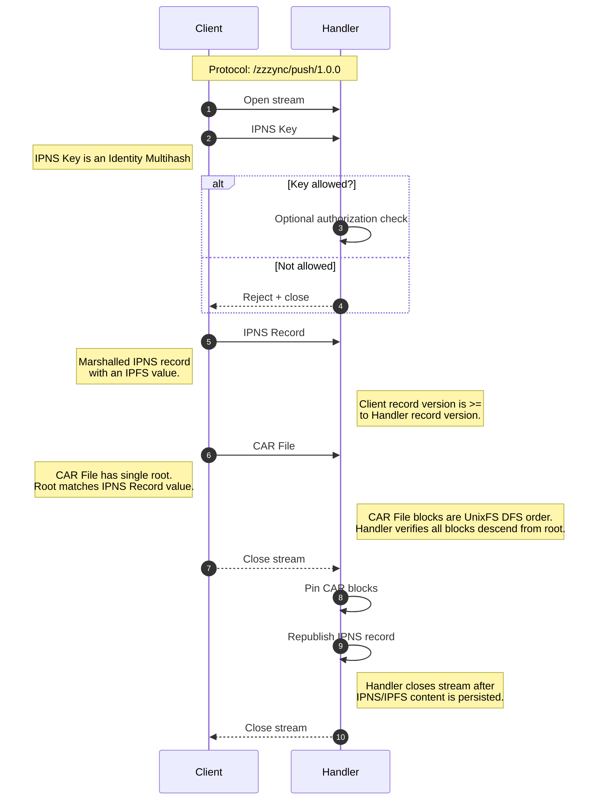

# Zzzync Protocol

> Group of utils that make it easy to backup and sync data over libp2p

## Zzzync Push

Push an IPNS Record and a CAR file to a Zzzync handler.

protocol id: `/zzzync/push/1.0.0`

### Stream:

### Notes

- Only supports IPNS Keys using Identity multihashes (multicodec: 0x00).

<!-- ## Zzzync Push Bitswap

`/zzzync/push/bs`

Triggers a Zzzync server to pull the latest changes from the client over bitswap.
The client sends its latest IPNS Record and the helia node gets all the missing blocks and then pins the new root.

Both send Multihash then IPNS Record first.

- [ ] Check if handlers are safe opening up streams, maybe use the given connection to do it.
  - i bet its fine, might be a reason the connection is given

There needs to be a flag for whether to refresh the IPNS Record
The IPNS Record is always pushed and is used for reading the authenticated IPFS Root and for Authorization. -->

